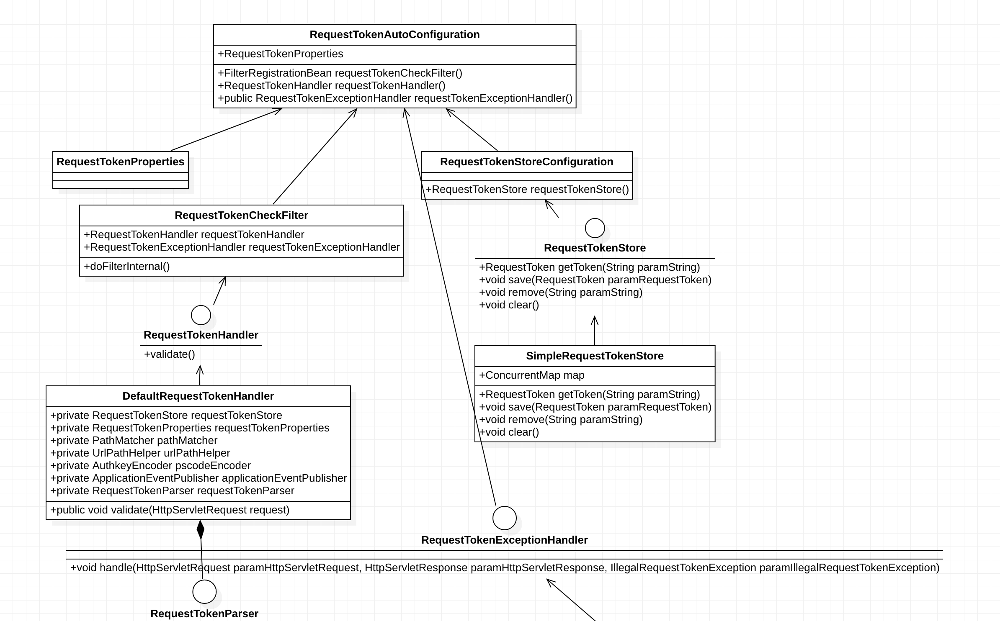
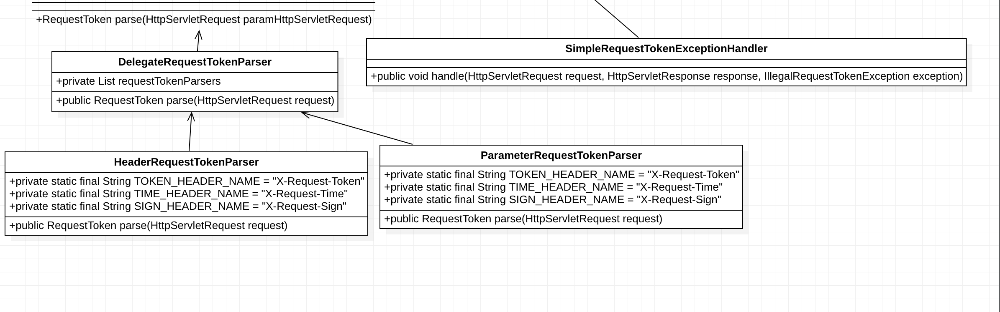
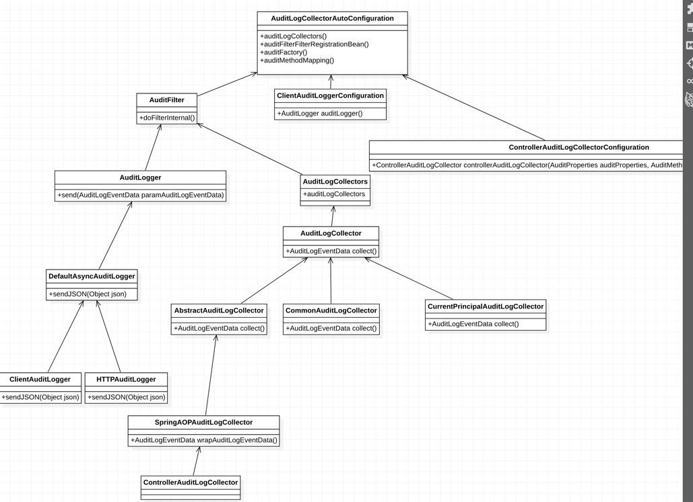

# spring-cloud-system 架构
**1. 目录结果**
### cloud-eureka
### cloud-zuul 添加一次性请求令牌

前端生成token：

const _generateOnceToken = (protocol, salt) => {

​    let token = {

​      token: uuid.v4(),  //uuid

​      timestamp: new Date().getTime(), //当前时间戳

​      sign: null

​    }

​    let value = token.timestamp + ',' + token.token //当前时间戳+uuid+盐

​    if (salt) {

​        value = value + ',' + salt

​    }

​    token.sign = smcrypto.Sm3Utils.encrypt(value)  //sm3加密

​    return token

}

前端绑定token到header：

​        return {

​            'X-Request-Token': onceToken.token,

​            'X-Request-Time': onceToken.timestamp,

​            'X-Request-Sign': onceToken.sign

​        }

后端完成验证。

 

### cloud-app
####   cloud-app-audit  //启动类
## 审计功能完成业务数据访问的拦截并存入到数据库。
## 1.根据sql脚本在数据库创建审计日志表
## 2.在启动类添加扫描包 
##  @MapperScan(basePackages= {"com.cloud.kjetboy.server.audit.mapper"})
##  @SpringBootApplication(scanBasePackages={"com.cloud.kjetboy.server.audit"})
## 3.在需要添加审计的controller类上添加注解@Audit
## 暂时不实现展现功能
## 上面是单体模式，如果是审计的client->server模式。
## 1. client就是这个 cloud-app-audit单体项目，在写入数据库的时候可以用http模式调用服务端
## 2。 服务端接收服务，完成数据写入 。 然后在查询出数据，完成数据分类，实现审计服务。
## 核心类图

####   cloud-app-crawler //启动类
### cloud-server
####   cloud-server-audit
####   cloud-server-crawler

